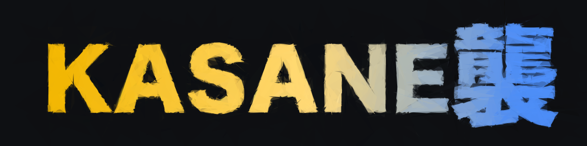
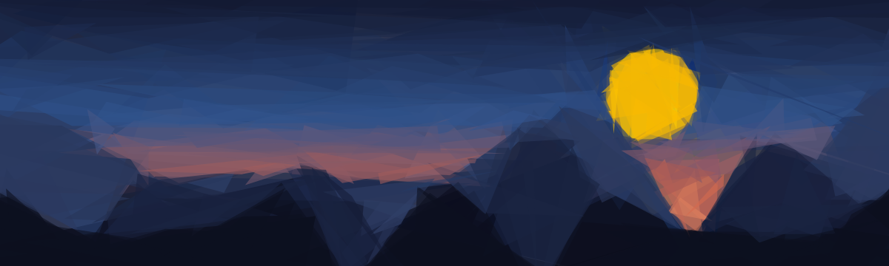
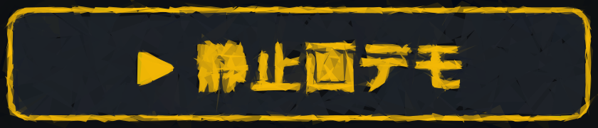
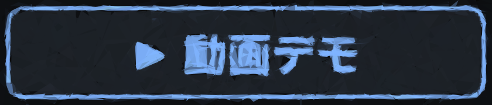
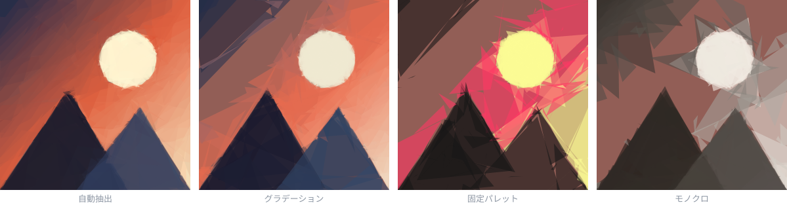

<p align="center">
  
</p>

<p align="center"><b>Layered Geometric Primitive-Based Image Approximation</b></p>

<p align="center"><a href="./README.md">日本語</a> ｜ <b>English</b></p>

<p align="center">
  
</p>

[](https://github.com/kariyamaso/kasane/actions/workflows/ci.yml)
[](LICENSE)

<p align="center">
  <a href="https://kariyamaso.github.io/kasane/?lang=en"></a>&nbsp;
  <a href="https://kariyamaso.github.io/kasane/video.html?lang=en"></a>
</p>

> A web app that progressively reconstructs a target image by layering
> semi-transparent geometric primitives (triangles, quads, circles, polygons,
> lines, Bézier curves). Uses stochastic hill climbing with optional simulated
> annealing, closed-form optimal color solving, and scanline-based incremental
> SSE evaluation — all running in a Web Worker. Exports PNG / SVG / JSON.
> Fully client-side, no server required.

**Kasane (襲 / かさね)** is named after
[kasane no irome](https://en.wikipedia.org/wiki/Irome), the Heian-era practice
of layering translucent garments so that the overlapping colors form a new
composite hue — which is, quite literally, what this program does: it layers
translucent geometric shapes while keeping their colors under palette control.

The app reconstructs a target image step by step from simple shapes —
triangles, quads, circles, regular polygons, line segments, Bézier strokes —
rendered semi-transparently on top of each other. With few shapes N only the
rough forms appear; as N grows, detail is recovered
(coarse-to-fine / progressive approximation).

```
Î_N(x, y) = Composite(P_1, P_2, …, P_N)
P_i       = (shape, position, size, rotation, color, α)
```

## How it differs from existing implementations

Comparison with implementations in the same lineage. **To avoid overclaiming,
features of the other tools are listed only as far as they could be verified
from official READMEs, UI definitions, and API docs** ("none" means "not found
as a documented feature").

|                    | [fogleman/primitive](https://github.com/fogleman/primitive) | [Geometrize](https://github.com/Tw1ddle/geometrize)                        | [primitive.js](https://github.com/ondras/primitive.js)      | **Kasane**                                                                             |
| ------------------ | ------------------------------------------------------------ | --------------------------------------------------------------------------- | ------------------------------------------------------------ | --------------------------------------------------------------------------------------- |
| Form               | CLI (Go)                                                      | Desktop GUI (Qt) + Haxe library                                              | Browser                                                       | Browser                                                                                  |
| Shapes             | 8 kinds + combo                                               | 9 kinds                                                                      | 4 kinds                                                       | 10 kinds                                                                                 |
| Color              | Optimal color (automatic)                                     | Optimal color (automatic)                                                    | Optimal color (automatic; only background color configurable) | Optimal color **+ projection onto gradient / fixed palette / monochrome ramp, source blend** |
| Shape size bounds  | None                                                          | Not in the GUI (possible by editing ChaiScript shape mutators)               | None                                                          | **GUI sliders for min/max circumradius**                                                 |
| Intermediate state | Numbered output via `-nth` / animated GIF                     | Step execution, numbered PNGs, animated GIF                                  | Sequential display only                                       | **All steps retained; scrub and replay in both directions**                              |
| Placement bounds   | None                                                          | Yes (Shape Bounding Area)                                                    | None                                                          | None                                                                                     |
| Extensibility      | Modify source                                                 | **Many ChaiScript hooks** (energy function, mutation, callbacks)             | Modify source                                                 | Modify source                                                                            |
| Parallelism        | Yes (`-j`)                                                    | Yes (`maxThreads`)                                                           | None                                                          | None (single Worker)                                                                     |
| Output             | PNG/JPG/SVG/GIF                                               | PNG/numbered PNG/SVG/GIF/JSON/HTML5 canvas/WebGL                             | PNG/SVG                                                       | PNG/SVG/JSON                                                                             |

**The essential functional difference is a single point: color governance.**
By inserting a layer that projects the closed-form optimal color onto a
user-specified color space, you can swap the artistic style while preserving
fidelity.

<p align="center">
  
</p>
<p align="center"><sub>
Same input, same seed (= identical search process), only the color constraint changed. The geometry is shared; only the colors differ.
</sub></p>

None of the four implementations above documents palette/gradient constraints
(Geometrize has a `customEnergyFunction` script hook, so something similar
could be built with scripting).

Size bounds and intermediate-state scrubbing are differences of **direct GUI
access** rather than raw capability (Geometrize needs script edits; primitive
needs flags and external tools). For extensibility and parallelism, Geometrize
is clearly ahead.

## Names for this technique

| Context                                     | Name                                                                                          |
| ------------------------------------------- | ---------------------------------------------------------------------------------------------- |
| Generic                                     | Geometric Primitive-Based Image Approximation / Primitive-Based Image Reconstruction            |
| The property that partial results look right | Progressive Image Approximation / Coarse-to-Fine Image Reconstruction                           |
| Evolutionary-computation lineage            | Evolutionary Image Approximation / Evolutionary Art / Genetic Algorithm Image Reconstruction    |
| Restricted to polygons                      | Polygon-Based Image Approximation                                                               |
| Representative implementations              | [fogleman/primitive](https://github.com/fogleman/primitive) (Go), Roger Alsing's "EvoLisa" (GA) |

This implementation follows the fogleman/primitive family:
**stochastic hill climbing + simulated annealing**
(1–2 orders of magnitude faster than GA, reaching lower error at the same
shape count).

## Algorithm

Each step commits one shape.

1. **Random candidates** — generate `randomTries` random candidates from the enabled shape kinds
2. **Closed-form optimal color** — for the pixels a shape covers, the fill color that best matches the target after compositing can be solved analytically

   ```
   composite: result = current·(1-α) + s·α
   setting result ≈ target gives  s = current + (target - current)/α
   ```

   averaged over the covered pixels. Since color never needs to be searched, the search space is geometry only.

3. **Apply the color constraint** — project the optimal color onto the user-specified color space (gradient / fixed palette / monochrome ramp)
4. **Local search** — from the best candidate, refine geometry with (optional) simulated annealing → hill climbing
5. **Commit & composite** — α-blend the shape with the lowest error into the current buffer

### Performance notes

- Shapes are converted to **scanlines (fill spans `[y, x1, x2]` per row)** so only covered pixels are visited
- Error is carried as running SSE and **updated differentially** over covered pixels only
  → evaluating a candidate does not depend on image size
- One candidate is evaluated in **a single pass over covered pixels**: collecting the statistics Σe, Σe² of `e = target - current·(1-α)` yields both the optimal color `s* = Σe/(n·α)` and the post-composite SSE `Σe² - 2αs·Σe + nα²s²` for any color s in closed form, merging the two passes (the division also leaves the pixel loop)
- Point-list generation (rotated-ellipse polygonalization, stroke outlines) reuses scratch buffers to avoid allocations in the evaluation loop
- Evaluation runs on a downscaled image (default 256px); display and export re-render vectorially at full resolution
- Optimization runs in a Web Worker so the UI never blocks. The worker is pre-created at page load and reused across runs, and the downscaled image is cached, so there is no perceptible lag between clicking Run and seeing the first shape
- SSE drift from 8-bit rounding is reset by a full recomputation every 32 steps

## Features

- **Target image**: drag & drop / file picker / built-in sample
- **Shapes**: triangle, free quad, rectangle (axis-aligned/rotated), ellipse (axis-aligned/rotated), circle, regular polygon (selectable sides), line segment, quadratic Bézier. Kinds can be mixed
- **Shape size**: min/max sliders as a fraction of the long side. See "Size control" below
- **Color**
  - `Auto from source` — use the optimal color as-is (most faithful)
  - `Gradient` — project onto a ramp built from any number of stops; mapping is "nearest (respect hue)" or "luma"
  - `Fixed palette` — use only the specified colors (poster / silkscreen look)
  - `Monochrome / tonal ramp` — map by luma onto a two-color ramp
  - `Source blend` — mix the constrained color with the source color at any ratio (0% = pure palette / 100% = source)
- **Intermediate states**: scrub to any step on the timeline, replay the construction with the play button
- **Continue from the end**: after completion (or while paused), raising only the shape count N and pressing Run continues from shape N+1 without recomputation; changing any other setting starts a fresh run
- **Views**: side-by-side / result only / source / difference heatmap
- **Export**: PNG (any resolution) / SVG (vector, infinitely scalable) / JSON (the shape sequence itself)
- **Reproducibility**: fixed random seed — identical settings always give identical results

## Video mode — composing footage from shapes with lifetimes and trajectories

<p align="center">
  
</p>
<p align="center"><sub>
Real output of the video pipeline (36 frames, 90 shapes). Unlike frame-independent processing, shapes <b>move as trajectories</b> instead of flickering.
This SVG is itself the Layer 4 keyframe export described below.
</sub></p>

`video.html` extends the image pipeline through time. The output
representation is not "a set of shapes per frame" but **a set of shapes with
lifetimes and trajectories**, with z-order (the index) held fixed.

```
𝒫 = { (θ_i(·), c_i(·), α_i, b_i, d_i) }_{i=1..M}     [b_i, d_i) = lifetime
R_t(𝒫) = Composite_{i: b_i ≤ t < d_i} (θ_i(t), c_i(t), α_i)

L(𝒫) = Σ_t ‖I_t − R_t‖²                    … fidelity
     + λ_v Σ_i Σ_t ‖θ_i(t+1) − θ_i(t)‖²_Λ  … trajectory smoothness
     + λ_M M                                … parsimony
     s.t. d_i − b_i ≥ L_min
```

Running the greedy solver independently per frame flickers. The cause is that
greedy addition is a discrete argmax choice and therefore **discontinuous in
its input**, so the solver here is a warm-start sequential one that constrains
each solution to the neighborhood of the previous frame's solution
(λ_v = 0, L_min = 1, k = 0 reduces to frame-independent processing).

| Layer                | Processing                                                                                                                                                                                                                                                                             |
| -------------------- | --------------------------------------------------------------------------------------------------------------------------------------------------------------------------------------------------------------------------------------------------------------------------------------- |
| Layer 0 preprocess   | 3-frame temporal bilateral (moving pixels are not mixed) + shot-cut detection by inter-frame RMSE. Never advect across a cut                                                                                                                                                             |
| Layer 1 advection    | Sample up to 28 points from each shape's support, solve sparse pyramidal Lucas–Kanade, least-squares fit a 2×3 affine, project onto the shape's degrees of freedom (translation + radius for circles, rotation too for angled shapes). No dense flow needed — O(M × a few dozen points)   |
| Layer 2 refit        | Composite in one bottom-to-top z-sweep; only the top fraction (default 40%) by support residual gets warm-start hill climbing. The smoothness term λ\_v·n·‖θ−θ̂‖²\_Λ is added directly to the score (Λ converts angles to arc length in px). Optimal colors are re-solved in closed form every frame and mixed with color inertia |
| Layer 3 birth/death  | A shape whose contribution (SSE improvement per covered pixel) stays below τ_death for 2 consecutive frames retires; greedy additions against the residual are capped at B per frame. The **hysteresis τ_birth = 4·τ_death** prevents flicker near the threshold. Birth and death ramp α over k frames (choreography) |
| Layer 4 keyframing   | After all frames, run parameter-space Ramer–Douglas–Peucker on each θ_i(t) (tolerance ε; angles unwrapped and arc-length weighted), compressing per-frame values into sparse keyframes                                                                                                    |

**Export**: the keyframed trajectories go straight to **SMIL-animated SVG**
(`<animate>` interpolates geometry, color, and opacity; opacity 0 outside the
lifetime) and **JSON**. PNG / static SVG of the current frame also available.

Measured on a synthetic clip (moving circle, 40 frames, 30 shapes):
churn 0.5 shapes/frame, mean track lifetime 17 frames, RDP compresses to ~55%
of the samples.

**Not yet implemented (remaining from the design)**: quantitative evaluation
via warped error ρ (needs dense flow), anchors every K frames + bidirectional
propagation, one smooth-then-refit consistency pass, learned proposal
distributions (residual map → placement heatmap CNN). Processing is currently
forward-causal only.

## Usage

```bash
npm install
npm run dev      # http://localhost:5173
npm run build    # emits static files into dist/ (deployable anywhere)
npm run preview
```

### Headless verification

```bash
npm run build
npx vite preview --port 4173 &
CHROME_PATH=/path/to/chrome node test/smoke.mjs   # screenshots land in tmp/
CHROME_PATH=/path/to/chrome node test/size.mjs
CHROME_PATH=/path/to/chrome node test/video.mjs   # video mode (generates a synthetic webm; checks completion, churn, animated SVG)
CHROME_PATH=/path/to/chrome node test/rerun.mjs   # verifies the rerun branching (extend vs fresh run)
```

## Size control

Size is treated throughout as the **circumradius R** (distance from the
centroid to the farthest point). The UI "size range" slider specifies lower
and upper bounds **as a fraction of the image's long side** (default 1.5%–30%).
The bounds apply to both generation and mutation, so they hold across the
entire search.

| Shape                 | Interpretation of R                                                                            |
| --------------------- | ----------------------------------------------------------------------------------------------- |
| Triangle / free quad  | Max distance from centroid to a vertex                                                           |
| Rect / rotated rect   | Half the diagonal                                                                                |
| Ellipse / rotated     | Semi-major axis                                                                                  |
| Circle / regular poly | Radius / circumradius                                                                            |
| Line / Bézier         | Max distance of endpoints (and control point) from their centroid; stroke width derives from `[0.3·minR, 0.25·maxR]` |

Out-of-range shapes are pushed back by `constrainSize()`: free-vertex shapes
scale about their centroid, radial shapes scale preserving aspect ratio, so
forms never collapse.

Examples (sample image, 80 shapes, 256px, all shape kinds):

| Setting            | Result                                                                  |
| ------------------ | ------------------------------------------------------------------------ |
| 1.0%–3.0%          | Stipple / pointillism. RMSE 0.185 (few shapes cannot cover the canvas)    |
| 1.5%–30% (default) | Standard. RMSE 0.047                                                      |
| 35%–60%            | Bold planar composition, abstract look. RMSE 0.069                        |

For small-shape-only compositions raise N (1000+); for large shapes keep N
low (50–150) and lower α to blend.

## Internal size-related constants

Where to look when the sliders are not enough (`src/core/shapes.ts`).
`u = long side of the compute resolution`.

| Constant           | Default                             | Meaning                                     |
| ------------------ | ----------------------------------- | ------------------------------------------- |
| `sigma`            | `min(u·0.06, maxR·0.6) · temp`      | Std-dev of position/radius mutation jitter  |
| `strokeRange()`    | `[0.3·minR, 0.25·maxR]`             | Stroke width range for line/Bézier          |
| Coordinate clamp   | `[-0.15w, 1.15w] × [-0.15h, 1.15h]` | Allowed off-canvas overhang                 |
| Angle jitter       | `N(0, 0.5·temp)` rad                | Rotation mutation width                     |
| `halfExtents()`    | `θ ∈ [0.24, π/2−0.24]`              | Allowed rectangle aspect-ratio range        |
| `ELLIPSE_SEGMENTS` | 40                                  | Polygonalization of rotated ellipses        |

## Parameter intuitions

| Parameter           | Effect                                                                                  |
| ------------------- | ----------------------------------------------------------------------------------------- |
| Shape count N       | More shapes = more detail. 200–1000 is the practical range                                 |
| Size range          | Narrow & small = pointillism; wide & large = abstract. Tune together with N                |
| α (opacity)         | Lower = smoother, needs more shapes. ~128 is standard; 64–96 gives a watercolor feel       |
| Compute resolution  | Quality/speed trade-off. 256px is usually enough                                           |
| Random candidates   | More candidates find better shapes but cost scales linearly                                |
| Hill-climb patience | Persistence of local refinement; higher = better quality per shape                         |
| Annealing           | Helps escape local optima; effective for complex shapes (rotated ellipses, Béziers)        |
| Temperature         | Higher accepts worse moves more readily. 0.2–0.5 is a good range                           |

Reference numbers (sample image 640×640, compute 192px, 32 candidates,
patience 16, 150 shapes):

| Shapes                              | Color         | RMSE   | Match | Time |
| ----------------------------------- | ------------- | ------ | ----- | ---- |
| Triangles                           | Auto          | 0.0253 | 97.5% | 0.5s |
| Circles + polygons + rot. ellipses  | Gradient      | 0.0839 | 91.6% | 0.3s |
| Rot. rects + quads                  | Fixed palette | 0.0942 | 90.6% | 0.3s |
| Lines + Béziers                     | Monochrome    | 0.1888 | 81.1% | 0.2s |

## Layout

```
index.html
src/
  main.ts              UI wiring, state management, export
  style.css
  ui/
    i18n.ts            Japanese/English UI dictionary and switcher
    render.ts          High-resolution Canvas 2D rendering
  core/
    types.ts           Shape / config / worker message types
    rng.ts             Reproducible PRNG (mulberry32)
    raster.ts          Scanline rasterizer (nonzero winding / ellipses / stroke outlines)
    shapes.ts          Shape generation, mutation, rasterization
    color.ts           Color constraints (ramp/palette projection)
    score.ts           Full SSE, single-pass error statistics (closed-form optimal color & delta SSE), α compositing
    model.ts           One optimization step (random search → annealing → hill climb)
    svg.ts             SVG export at any step
    worker.ts          Optimization worker
  video/               Video mode (video.html)
    types.ts           Track / keyframe / config / worker message types
    flow.ts            Sparse pyramidal LK, affine fit, projection onto shape DOF, Λ distance
    model.ts           Sequential solver (advect → refit → birth/death)
    keyframes.ts       Parameter-space RDP keyframing
    animsvg.ts         SMIL-animated SVG export
    worker.ts          Video worker (cut detection, temporal bilateral)
    main.ts            Video page UI, frame extraction, playback
test/
  smoke.mjs            Headless check via Playwright (4 shape×color cases: completion & error decrease)
  size.mjs             Verifies size bounds hold at every step, from the JSON export
  video.mjs            Video-mode check (synthetic webm: completion, churn, keyframing, animated SVG)
  rerun.mjs            Verifies rerun branching (extend vs fresh run)
scripts/
  readme-assets.mjs    Generates the README SVGs (title/hero/palette/video demo) with the app's own pipeline
docs/assets/           Output of the script above (referenced from the README)
```

Every image in this README is Kasane's own output and can be regenerated with
(seeds are fixed, so it is deterministic):

```bash
CHROME_PATH=/path/to/chrome node scripts/readme-assets.mjs
```

## Extension points

- **Add a new shape**: add to `ShapeKind` in `types.ts` → add branches in `randomShape` / `mutateShape` / `shapeScanlines` / `outlinePoints` in `shapes.ts` → add rendering in `svg.ts` and `ui/render.ts`. That alone plugs it into optimization, UI, and export
- **Different error metric**: swap `partialSSE` in `score.ts` (SSIM-like weighting, gradient terms, …)
- **Compare against GA**: swap `search()` in `model.ts` to implement an evolutionary version on the same evaluation machinery
- **Analyze shape sequences**: the JSON export contains every shape's parameters, color, α, and the RMSE at that step — ready for "error decay vs N" or "contribution by shape kind" analyses

## License

[MIT](LICENSE)
