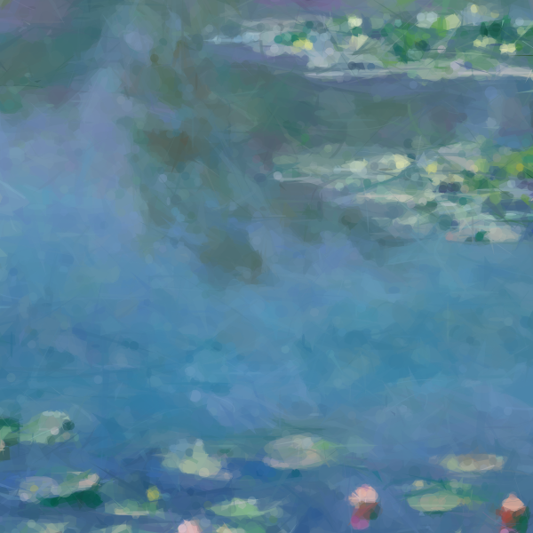
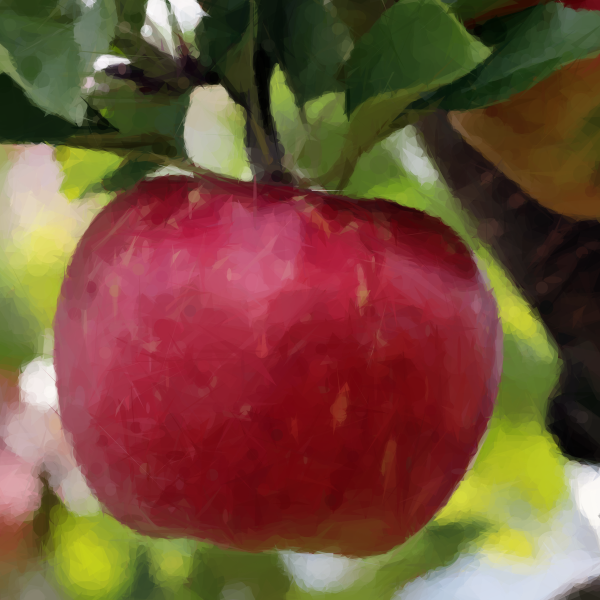
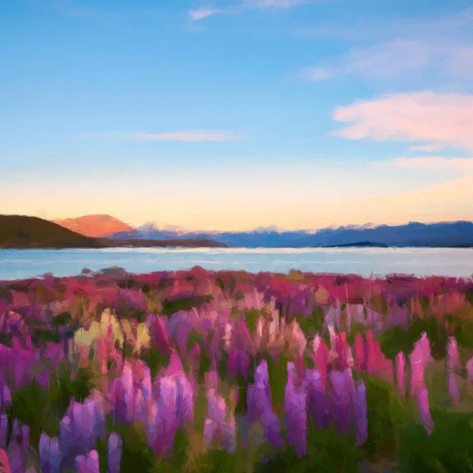

<p align="center">
  
</p>

<p align="center"><b>Layered Geometric Primitive-Based Image Approximation</b></p>

<p align="center"><b>日本語</b> ｜ <a href="./README.en.md">English</a></p>

<p align="center">
  
</p>

[](https://github.com/kariyamaso/kasane/actions/workflows/ci.yml)
[](LICENSE)

<p align="center">
  <a href="https://kariyamaso.github.io/kasane/?lang=ja"></a>&nbsp;
  <a href="https://kariyamaso.github.io/kasane/video.html?lang=ja"></a>
</p>
<p align="center"><sub>
▲ Use the App — クリックするとブラウザでそのまま動く Web アプリが開きます(インストール不要・完全クライアントサイド)
</sub></p>

> A web app that progressively reconstructs a target image by layering
> semi-transparent geometric primitives (triangles, quads, circles, polygons,
> lines, Bézier curves). Uses stochastic hill climbing with optional simulated
> annealing, closed-form optimal color solving, and scanline-based incremental
> SSE evaluation — all running in a Web Worker. Exports PNG / SVG / JSON.
> Fully client-side, no server required.

**Kasane（襲／かさね）** は、半透明の衣を何枚も重ねて合成色を作る平安期の色彩技法
「[襲の色目](https://ja.wikipedia.org/wiki/%E8%A5%B2%E3%81%AE%E8%89%B2%E7%9B%AE)」に由来します。
半透明の幾何図形を重ね、パレットで色を統制しながら像を立ち上げるこのアプリの動作そのものです。

基準画像を、三角形・四角形・円・正多角形・線分・ベジェ曲線などの単純図形を
半透明で重ねることによって段階的に構成する Web アプリケーションです。


## Example

<p align="center">
  
  
  
  
</p>
<p align="center"><sub>
すべて Kasane の出力(構成過程をループ再生)。左から:
モネ《睡蓮》(三角形・楕円・円・ベジェ・正多角形の混成 4000図形) ／
ゴッホ《星月夜》(固定パレット4色・α101・12000図形) ／
林檎(円・楕円中心 3500図形) ／ ルピナスの湖畔(ベジェ曲線入り 4500図形)。
絵画はいずれもパブリックドメイン(《睡蓮》1906年・《星月夜》1889年)
</sub></p>


## アルゴリズム

各ステップで 1 図形を確定させる。

1. **ランダム候補生成** — 有効化された図形種別からランダムに `randomTries` 個の候補を生成
2. **最適色を閉形式で決定** — 図形が覆う画素集合について、合成後に元画像へ最も近づく塗り色は解析的に解ける

   ```
   合成: result = current·(1-α) + s·α
   result ≈ target とすると  s = current + (target - current)/α
   ```

   これを被覆画素で平均する。「色を探索する」必要がないので探索空間は幾何パラメータだけになる。

3. **配色制約の適用** — 求めた最適色を、ユーザー指定の色空間(グラデーション / 固定パレット / モノクロ階調)へ射影
4. **局所探索** — 最良候補を初期解として、焼きなまし(任意)→ 山登り法で幾何パラメータを改善
5. **確定・合成** — 誤差が最も減る図形を current バッファへ α 合成


## 動画版

<p align="center">
  
  
</p>
<p align="center"><sub>
いずれも動画パイプラインの実出力。左: エドワード・マイブリッジ《動く馬》(1878年・パブリックドメイン、
15フレーム・図形140個、紺→白のグラデーションへ輝度で射影) ／ 右: 日輪が渡る合成シーン(36フレーム・図形90個)。
図形が明滅せず<b>軌跡として動く</b>のがフレーム独立処理との違い
</sub></p>

| 層                     | 処理                                                                                                                                                                                                                                  |
| ---------------------- | ------------------------------------------------------------------------------------------------------------------------------------------------------------------------------------------------------------------------------------- |
| Layer 0 前処理         | 3フレーム時間バイラテラル(動きのある画素は混ぜない)+ フレーム間 RMSE によるカット検出。カットをまたいで輸送しない                                                                                                                     |
| Layer 1 輸送           | 各図形の支持領域から最大28点をサンプルし、疎なピラミッド型 Lucas–Kanade → 2×3 アフィンを最小二乗フィット → 図形の自由度へ射影(円なら平行移動+半径、角度持ちは回転も)。密フロー不要で O(M×数十点)                                      |
| Layer 2 再フィット     | z順の下から上への1掃引で合成しつつ、支持領域残差の大きい上位(既定40%)だけ warm start の山登り。スコアには λ\_v·n·‖θ−θ̂‖²\_Λ を直接足す(Λ は角度を弧長換算して px に揃える対角重み)。最適色は毎フレーム閉形式で解き直し、色の慣性で混ぜる |
| Layer 3 生死           | 寄与(被覆1画素あたりのSSE改善)が τ_death 未満 × 2フレーム連続で退場、残差への貪欲追加は 1フレーム B 個まで。**τ_birth = 4·τ_death のヒステリシス**が閾値付近の明滅を防ぐ。生死は瞬時にせず k フレームかけて α をランプ(振り付け)      |
| Layer 4 キーフレーム化 | 全フレーム処理後、各 θ_i(t) にパラメータ空間の Ramer–Douglas–Peucker(許容 ε、角度は unwrap + 弧長換算)を走らせ、毎フレーム値を疎なキーフレーム列へ圧縮                                                                                |


## 使い方

**Web アプリ(インストール不要)**: [静止画版](https://kariyamaso.github.io/kasane/?lang=ja) ／ [動画版](https://kariyamaso.github.io/kasane/video.html?lang=ja)

以下はローカルで開発・ビルドする場合:

```bash
npm install
npm run dev      # http://localhost:5173
npm run build    # dist/ に静的ファイルを出力(そのままどこにでも置ける)
npm run preview
```

### 動作確認(ヘッドレス)

```bash
npm run build
npx vite preview --port 4173 &
CHROME_PATH=/path/to/chrome node test/smoke.mjs   # tmp/ にスクリーンショットが出る
CHROME_PATH=/path/to/chrome node test/size.mjs
CHROME_PATH=/path/to/chrome node test/video.mjs   # 動画版(合成webmを生成して完走・churn・アニメSVGを検証)
CHROME_PATH=/path/to/chrome node test/rerun.mjs   # 図形数変更→再実行(続きから追加/新規実行の分岐)を検証
```


## パラメータの勘所

| パラメータ     | 効果                                                                             |
| -------------- | -------------------------------------------------------------------------------- |
| 図形数 N       | 大きいほど細部が出る。200〜1000 が実用域                                         |
| サイズ範囲     | 狭く小さく取ると点描調、広く大きく取ると抽象画調。N とセットで調整する           |
| α (不透明度)   | 小さいほど滑らか・多くの図形が必要。128 前後が標準。小さめ(64〜96)にすると水彩的 |
| 計算解像度     | 品質と速度のトレードオフ。256px で十分なことが多い                               |
| ランダム候補数 | 大きいほど良い図形を引きやすいが線形に遅くなる                                   |
| 山登り停滞許容 | 局所改善の粘り。大きいほど 1 図形あたりの品質が上がる                            |
| 焼きなまし     | 局所解から抜け出しやすくなる。図形が複雑(回転楕円・ベジェ)なときに効く           |
| 温度           | 高いほど悪化を受け入れやすい。0.2〜0.5 が目安                                    |

参考値(サンプル画像 640×640、計算解像度 192px、候補32・停滞16、150 図形):

| 図形                 | 配色           | RMSE   | 一致度 | 時間 |
| -------------------- | -------------- | ------ | ------ | ---- |
| 三角形               | 自動抽出       | 0.0253 | 97.5%  | 0.5s |
| 円+正多角形+回転楕円 | グラデーション | 0.0839 | 91.6%  | 0.3s |
| 矩形(回転)+四角形    | 固定パレット   | 0.0942 | 90.6%  | 0.3s |
| 線分+ベジェ          | モノクロ       | 0.1888 | 81.1%  | 0.2s |


## 構成

```
index.html
src/
  main.ts              UI の配線・状態管理・書き出し
  style.css
  core/
    types.ts           図形・設定・Worker メッセージの型
    rng.ts             再現性のある擬似乱数 (mulberry32)
    raster.ts          スキャンライン・ラスタライザ(nonzero winding / 楕円 / ストローク輪郭)
    shapes.ts          図形の生成・変異・ラスタライズ
    color.ts           配色制約(ランプ/パレット射影)
    score.ts           SSE 全体計算・誤差統計の単一パス収集(最適色と差分 SSE を閉形式で導出)・α合成
    model.ts           1ステップの最適化(ランダム探索 → 焼きなまし → 山登り)
    svg.ts             任意ステップの SVG 書き出し
    worker.ts          最適化ワーカー
  ui/
    i18n.ts            日本語/英語の UI 辞書と切替
    render.ts          Canvas 2D への高解像度描画
  video/               動画版(video.html)
    types.ts           トラック・キーフレーム・設定・Worker メッセージの型
    flow.ts            疎ピラミッドLK・アフィンフィット・図形自由度への射影・Λ距離
    model.ts           逐次ソルバ(輸送 → 再フィット → 生死 → 誕生)
    keyframes.ts       パラメータ空間 RDP によるキーフレーム化
    animsvg.ts         SMIL アニメーション SVG 書き出し
    worker.ts          動画ワーカー(カット検出・時間バイラテラルを含む)
    main.ts            動画ページの UI・フレーム抽出・再生
test/
  smoke.mjs            Playwright によるヘッドレス動作確認(4通りの図形×配色で完走と誤差低下を検証)
  size.mjs             サイズ範囲が全ステップで守られているかを JSON 書き出しから検証
  video.mjs            動画版の動作確認(合成webmで完走・churn・キーフレーム化・アニメSVGを検証)
  rerun.mjs            図形数変更→再実行の分岐(続きから追加 / 新規実行)を検証
scripts/
  readme-assets.mjs    README 用 SVG(タイトル/ヒーロー/配色比較/動画デモ)をアプリ自身のパイプラインで生成
docs/assets/           上記スクリプトの出力(README から参照される)
```


## 類似プロジェクト

- [fogleman/primitive](https://github.com/fogleman/primitive) — Go 製 CLI。この系譜の代表実装
- [Geometrize](https://github.com/Tw1ddle/geometrize) — デスクトップ GUI (Qt) + Haxe ライブラリ
- [primitive.js](https://github.com/ondras/primitive.js) — ブラウザ実装
- Roger Alsing の "EvoLisa" — 遺伝的アルゴリズムによる先駆的実装


## Creator

<p align="center">
  <a href="https://x.com/so_kariyama"></a>
</p>
<p align="center">
  <a href="https://x.com/so_kariyama"></a>
</p>


## License

[MIT](LICENSE)
